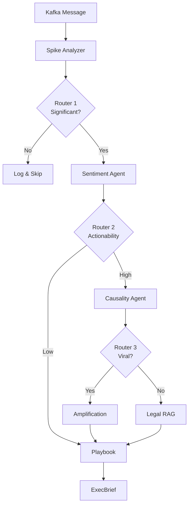

# Dolpin: Design Document

## Overview

The Social Media Spike Analysis System is a multi-agent workflow orchestrated by LangGraph that processes real-time social media data to detect crises and opportunities for entertainment industry clients. The system employs a three-stage routing architecture that optimizes cost by filtering insignificant events early and routing complex cases through specialized analysis agents.

### Key Design Principles

1. **Cost Optimization**: Early filtering and conditional expensive operations (RAG, network analysis)
2. **Resilience**: Graceful degradation when individual agents fail
3. **Traceability**: Comprehensive state tracking with trace_id throughout workflow
4. **Modularity**: Independent agents with well-defined interfaces
5. **Type Safety**: TypedDict schemas for all data structures

### System Context

```
[Kafka] → [Spike Analyzer] → [Router 1] → [Sentiment] → [Router 2] → [Causality] → [Router 3] → [Legal/Amplification] → [Playbook] → [ExecBrief]
                                  ↓                          ↓                                        ↓
                               [Skip]                  [Skip to Playbook]                      [Skip to Playbook]
```

## Architecture

### Component Overview

The system consists of the following major components:

1. **Kafka Consumer**: Ingests messages from multiple social media sources
2. **Spike Analyzer**: Detects and characterizes sudden activity increases
3. **Router (3 stages)**: Makes workflow routing decisions based on analysis results
4. **Sentiment Agent**: Classifies emotional tone using ML models and lexicon matching
5. **Causality Agent**: Analyzes network propagation patterns and influence
6. **Legal RAG Agent**: Assesses legal risks using keyword matching and document retrieval
7. **Amplification Node**: Identifies viral amplification opportunities
8. **Playbook Agent**: Generates strategic response recommendations
9. **ExecBrief Generator**: Produces executive summary reports

### Data Flow Architecture



### State Management

The system maintains a single `AnalysisState` object that flows through all nodes:

```python
class AnalysisState(TypedDict):
    # Input
    spike_event: SpikeEvent
    trace_id: str
    workflow_start_time: str
    
    # Router decisions
    route1_decision: Literal["skip", "analyze"] | None
    route2_decision: Literal["sentiment_only", "full_analysis"] | None
    route3_decision: Literal["legal", "amplification"] | None
    positive_viral_detected: bool | None
    
    # Agent results
    spike_analysis: SpikeAnalysisResult | None
    sentiment_result: SentimentAnalysisResult | None
    causality_result: CausalityAnalysisResult | None
    legal_risk: LegalRiskResult | None
    amplification_summary: Dict[str, Any] | None
    playbook: PlaybookResult | None
    
    # Insights and output
    node_insights: Dict[str, str]
    executive_brief: ExecBrief | None
    
    # Error handling
    error_logs: List[ErrorLog]
    skipped: bool
    skip_reason: str | None
```

## Components and Interfaces

### 1. Spike Analyzer

**Purpose**: Detect and characterize sudden increases in social media activity.

**Algorithm**:
1. Aggregate messages by keyword and time window
2. Calculate `spike_rate = current_volume / baseline`
3. Determine significance based on threshold
4. Calculate `actionability_score = (spike_intensity × 0.5) + (keyword_weight × 0.5)`
5. Classify spike type (organic/media_driven/coordinated) using heuristics
6. Classify spike nature (positive/negative/mixed/neutral) using keyword analysis
7. Calculate confidence: `base_confidence × data_completeness_factor × spike_clarity_factor`

**Interface**:
```python
def analyze(spike_event: SpikeEvent) -> SpikeAnalysisResult
```

**Key Decisions**:
- Actionability score combines spike intensity and keyword risk to enable early filtering
- Confidence degrades with partial data or low spike clarity
- Viral indicators (breakout, cross-platform) are extracted for downstream routing

### 2. Router Logic

**Purpose**: Make intelligent routing decisions to optimize cost and quality.

#### Router Stage 1: Significance Filter

**Decision Logic**:
```python
if spike_analysis.is_significant == False:
    return "skip"  # Log and terminate
else:
    return "analyze"  # Continue to Sentiment
```

**Rationale**: Filters out noise early (bot activity, temporary spikes) to save 100% of downstream costs.

#### Router Stage 2: Actionability-Based Routing

**Decision Logic**:
```python
actionability = spike_analysis.actionability_score

# Stage 1: Low actionability
if actionability < 0.3:
    return "sentiment_only"

# Stage 2: High actionability
if actionability >= 0.6:
    return "full_analysis"

# Stage 3: Medium actionability - check signals
if 0.3 <= actionability < 0.6:
    # Crisis signals
    if (sentiment.boycott >= 0.2 or
        sentiment.fanwar > 0.1 or
        sentiment.dominant_sentiment == "meme_negative" or
        (sentiment.has_mixed_sentiment and sentiment.sentiment_shift == "worsening")):
        return "full_analysis"
    
    # Opportunity signal
    if (spike_analysis.spike_nature == "positive" and
        spike_analysis.spike_rate >= 3.0 and
        sentiment.support >= 0.5):
        state.positive_viral_detected = True
        return "full_analysis"
    
    # No signals
    return "sentiment_only"
```

**Rationale**: 
- Saves expensive Causality and Legal RAG analysis for simple fan reactions
- Three-tier approach balances cost and quality
- Opportunity detection enables specialized amplification analysis

#### Router Stage 3: Legal vs Amplification

**Decision Logic**:
```python
if state.positive_viral_detected == True:
    return "amplification"
else:
    return "legal"
```

**Rationale**: Positive viral opportunities get specialized amplification analysis; all other cases get legal risk assessment as a safety check.

### 3. Sentiment Agent

**Purpose**: Classify emotional tone and detect special patterns (memes, fanwars).

**Algorithm**:
1. Apply ML classification model to each message
2. Calculate sentiment distribution across 7 categories
3. Identify dominant and secondary sentiments
4. Match against lexicon for Korean slang and meme keywords
5. Detect fanwar patterns and identify targets
6. Calculate confidence: `model_confidence × sample_quality_factor`

**Interface**:
```python
def analyze(messages: List[Message]) -> SentimentAnalysisResult
```

**Key Decisions**:
- 7-category taxonomy captures entertainment industry nuances (support, boycott, meme, fanwar)
- Lexicon matching supplements ML for Korean internet culture
- Confidence degrades with small sample sizes

### 4. Causality Agent

**Purpose**: Identify influential accounts and propagation patterns.

**Algorithm**:
1. Build retweet network graph from message relationships
2. Calculate network centrality metrics
3. Identify hub accounts (high degree, high betweenness)
4. Classify trigger source (influencer/media/organic)
5. Detect cascade pattern (viral/echo_chamber/coordinated)
6. Trace propagation paths

**Interface**:
```python
def analyze_network(
    spike_event: SpikeEvent,
    sentiment_context: Optional[SentimentAnalysisResult] = None
) -> CausalityAnalysisResult
```

**Key Decisions**:
- Network analysis focuses on Twitter retweet graphs (primary propagation mechanism)
- Hub account identification enables targeted engagement strategies
- Sentiment context is optional but helps interpret cascade patterns

### 5. Legal RAG Agent

**Purpose**: Assess legal risks using two-stage approach (keyword + RAG).

**Algorithm**:

**Stage 1: Lightweight Keyword Check** (~0.1s)
1. Check messages for legal keywords (고소, 표절, 명예훼손, etc.)
2. Consider spike_nature and dominant_sentiment
3. If no risk signals → return "clear" and skip RAG

**Stage 2: RAG Retrieval** (~12s, conditional)
1. Construct query from messages and context
2. Retrieve relevant legal documents (laws, precedents, cases)
3. Calculate risk level based on document matches
4. Generate recommended actions and legal basis

**Confidence Calculation**:
- Without RAG: `confidence = 0.95` (keyword matching is reliable)
- With RAG: `confidence = rag_confidence × retrieval_quality_factor`
  - retrieval_quality_factor: 1.0 (3+ docs), 0.7 (2 docs), 0.4 (1 doc)

**Interface**:
```python
def check_legal_risk(query_context: LegalRAGInput) -> LegalRiskResult
```

**Key Decisions**:
- Two-stage approach saves 12 seconds for clear cases (~60% of full_analysis path)
- Keyword list covers major legal risk categories for entertainment industry
- RAG provides detailed legal basis when risks are detected

### 6. Amplification Node

**Purpose**: Extract actionable information for viral amplification.

**Algorithm** (v1: Rule-based):
1. Extract top platforms from `cross_platform` data
2. Identify hub accounts with `influence_score > 0.7`
3. Select representative messages with high engagement
4. Generate suggested actions (engage influencers, provide official content, etc.)

**Interface**:
```python
def summarize_opportunity(state: AnalysisState) -> Dict[str, Any]
```

**Key Decisions**:
- v1 uses rule-based extraction (no LLM) for stability and cost
- Future v2 can add LLM for campaign copy generation
- Output feeds into Playbook for action generation

### 7. Playbook Agent

**Purpose**: Generate strategic response recommendations.

**Algorithm**:
1. Determine situation_type based on route3_decision and sentiment
2. Calculate priority based on severity and urgency
3. Generate recommended_actions:
   - Legal path → legal_response, issue_statement
   - Amplification path → amplify_viral, engage_influencers
   - Sentiment_only path → monitor_only, social_listening
4. Populate optional fields (draft, target_posts, legal_basis) based on action type
5. Identify key risks and opportunities

**Interface**:
```python
def generate_strategy(state: AnalysisState) -> PlaybookResult
```

**Key Decisions**:
- Single function handles all three routing paths
- Uses node_insights for context-aware recommendations
- Optional fields reduce payload size for simple cases

### 8. ExecBrief Generator

**Purpose**: Produce executive summary for decision-makers.

**Algorithm**:
1. Generate summary statement from playbook situation_type
2. Calculate severity_score (1-10) based on polarity and intensity
3. Generate section summaries from each agent result
4. Populate analysis_status for observability
5. Set user_message if any agents failed

**Key Decisions**:
- Severity score interpretation depends on polarity (crisis vs opportunity)
- Partial results are always delivered (graceful degradation)
- Analysis status enables debugging and quality monitoring

## Data Models

### Core Data Structures

#### SpikeEvent
```python
class SpikeEvent(TypedDict):
    keyword: str
    spike_rate: float
    baseline: int
    current_volume: int
    detected_at: str  # ISO 8601
    time_window: Literal["1h", "3h", "24h"]
    messages: List[Message]
    raw_kafka_message_ids: List[str]
```

#### Message
```python
class Message(TypedDict):
    id: str  # UUID
    source_message_id: str  # Original platform ID
    text: str
    timestamp: str  # ISO 8601
    source: Literal["twitter", "theqoo", "instiz", "google_trends"]
    author_id: str
    metrics: Dict[str, int]  # likes, retweets, etc.
    is_anonymized: bool
    detected_language: str
```

#### SpikeAnalysisResult
```python
class SpikeAnalysisResult(TypedDict):
    is_significant: bool
    spike_rate: float
    spike_type: Literal["organic", "media_driven", "coordinated"]
    spike_nature: Literal["positive", "negative", "mixed", "neutral"]
    peak_timestamp: str
    duration_minutes: int
    confidence: float  # 0.0-1.0
    actionability_score: float  # 0.0-1.0
    data_completeness: Literal["confirmed", "partial", "mixed"]
    partial_data_warning: str | None
    viral_indicators: ViralIndicators
```

#### SentimentAnalysisResult
```python
class SentimentAnalysisResult(TypedDict):
    sentiment_distribution: Dict[str, float]  # Sums to 1.0
    dominant_sentiment: str
    secondary_sentiment: str | None
    has_mixed_sentiment: bool
    sentiment_shift: Literal["worsening", "improving", "stable"] | None
    representative_messages: Dict[str, List[str]]
    meme_keywords: List[str] | None
    fanwar_targets: List[str] | None
    lexicon_matches: Dict[str, Dict[str, Any]] | None
    analyzed_count: int
    confidence: float  # 0.0-1.0
```

### Schema Validation Rules

1. **UUID Format**: All `id` and `message_id` fields use UUID format
2. **ISO 8601 Timestamps**: All datetime fields use ISO 8601 format
3. **Confidence Range**: All `confidence` fields must be in [0.0, 1.0]
4. **Proportion Sums**: All distribution dicts must sum to 1.0
5. **Enum Consistency**: Internal enums use lowercase_underscore, external enums preserved

## Correctness Properties

*A property is a characteristic or behavior that should hold true across all valid executions of a system—essentially, a formal statement about what the system should do. Properties serve as the bridge between human-readable specifications and machine-verifiable correctness guarantees.*

### Property 1: Spike Rate Calculation Correctness

*For any* spike event with positive baseline and current_volume, the calculated spike_rate should equal current_volume divided by baseline.

**Validates: Requirements 2.1**

### Property 2: Router 1 Decision Correctness

*For any* SpikeAnalysisResult, if is_significant is false then route1_decision should be "skip", and if is_significant is true then route1_decision should be "analyze".

**Validates: Requirements 3.1, 3.5**

### Property 3: Sentiment Distribution Sum Invariant

*For any* SentimentAnalysisResult, the sum of all values in sentiment_distribution should equal 1.0 (within floating point tolerance of 0.001).

**Validates: Requirements 4.2, 14.7**

### Property 4: Confidence Range Constraint

*For any* analysis result (SpikeAnalysisResult, SentimentAnalysisResult, LegalRiskResult), the confidence field should be in the range [0.0, 1.0].

**Validates: Requirements 14.6**

### Property 5: Router 2 Actionability Routing

*For any* valid state after sentiment analysis:
- If actionability_score < 0.3, then route2_decision should be "sentiment_only"
- If actionability_score >= 0.6, then route2_decision should be "full_analysis"
- If 0.3 <= actionability_score < 0.6, then route2_decision depends on crisis/opportunity signals

**Validates: Requirements 5.1, 5.2, 5.3, 5.4, 5.5, 5.6, 5.7, 5.8**

### Property 6: Router 3 Viral Detection Routing

*For any* valid state after causality analysis, if positive_viral_detected is true then route3_decision should be "amplification", otherwise route3_decision should be "legal".

**Validates: Requirements 7.1, 7.2**

### Property 7: Legal RAG Conditional Execution

*For any* set of messages with no legal keywords and spike_nature "positive", the Legal_RAG_Agent should set clearance_status to "clear" and rag_performed to false.

**Validates: Requirements 8.3, 15.2**

### Property 8: Severity Score Range

*For any* ExecBrief, the severity_score should be an integer in the range [1, 10].

**Validates: Requirements 11.2**

### Property 9: Analysis Status Enum Validity

*For any* ExecBrief, all values in analysis_status should be one of: "success", "failed", or "skipped".

**Validates: Requirements 11.10**

### Property 10: Error Resilience

*For any* workflow execution where an agent fails, the workflow should continue execution and populate error_logs with the failure details including trace_id.

**Validates: Requirements 12.1, 12.2**

### Property 11: Timestamp Format Compliance

*For any* data structure containing timestamp fields, all timestamps should match the ISO 8601 format pattern.

**Validates: Requirements 14.2**

### Property 12: Cost Optimization - Early Skip

*For any* spike event with actionability_score < 0.3, the Causality_Agent and Legal_RAG_Agent should not be invoked.

**Validates: Requirements 15.1**

### Property 13: Confidence Calculation Consistency

*For any* SpikeAnalysisResult, the confidence value should equal base_confidence × data_completeness_factor × spike_clarity_factor, where factors are determined by the specified rules.

**Validates: Requirements 2.9**

### Property 14: Sentiment Confidence Calculation

*For any* SentimentAnalysisResult, the confidence value should equal model_confidence × sample_quality_factor, where sample_quality_factor is determined by analyzed_count.

**Validates: Requirements 4.11**

### Property 15: Legal RAG Confidence Calculation

*For any* LegalRiskResult where rag_performed is true, the confidence value should equal rag_confidence × retrieval_quality_factor, where retrieval_quality_factor depends on the number of matched documents.

**Validates: Requirements 8.9**

## Error Handling

### Error Handling Strategy

The system employs a **graceful degradation** strategy:

1. **Agent-Level Isolation**: Each agent failure is caught and logged
2. **Workflow Continuation**: Workflow proceeds even if individual agents fail
3. **Partial Results**: ExecBrief is generated with available information
4. **Status Tracking**: `analysis_status` field indicates which agents succeeded/failed
5. **User Communication**: `user_message` explains limitations when failures occur

### Error Log Structure

```python
class ErrorLog(TypedDict):
    stage: Literal["spike_analyzer", "sentiment", "causality", "legal_rag", "playbook"]
    error_type: Literal["timeout", "schema_error", "exception", "api_error"]
    message: str
    occurred_at: str  # ISO 8601
    trace_id: str
    details: Dict[str, Any] | None
```

### Error Scenarios

| Scenario | Handling | User Impact |
|----------|----------|-------------|
| Sentiment Agent timeout | Log error, continue to Playbook with null sentiment_result | Limited sentiment analysis in brief |
| Legal RAG retrieval failure | Return quick check result only | Legal assessment based on keywords only |
| Causality Agent exception | Log error, skip to Playbook | No network analysis in brief |
| Multiple agent failures | Accumulate errors, generate partial brief | User message indicates limited analysis |
| Complete workflow failure | Log critical error, return error response | User notified of system issue |

## Testing Strategy

### Dual Testing Approach

The system requires both **unit tests** and **property-based tests** for comprehensive coverage:

#### Unit Tests
- Verify specific examples and edge cases
- Test integration points between components
- Validate error handling paths
- Test router decision logic with known inputs
- Verify data transformations

**Example Unit Tests**:
- Router 1 with is_significant=false returns "skip"
- Sentiment distribution with single category equals 1.0
- Legal RAG with no keywords returns "clear"
- ExecBrief generation with all agents successful

#### Property-Based Tests
- Verify universal properties across all inputs
- Use randomized input generation (minimum 100 iterations)
- Test invariants and mathematical properties
- Validate range constraints and format compliance

**Property Test Configuration**:
- Minimum 100 iterations per property test
- Each test tagged with: `Feature: social-media-spike-analysis, Property {N}: {property_text}`
- Use Hypothesis (Python) for property-based testing

**Example Property Tests**:
- Property 1: Spike rate calculation (generate random volumes/baselines)
- Property 3: Sentiment distribution sum (generate random distributions)
- Property 4: Confidence range (generate random analysis results)
- Property 11: Timestamp format (generate random timestamps)

### Test Coverage Goals

- **Unit Test Coverage**: 80% line coverage minimum
- **Property Test Coverage**: All 15 correctness properties implemented
- **Integration Test Coverage**: End-to-end workflow for each routing path
- **Error Injection Tests**: All error scenarios in error handling table

### Testing Tools

- **Unit Testing**: pytest
- **Property Testing**: Hypothesis
- **Mocking**: pytest-mock for external dependencies
- **Integration**: LangGraph test harness with stub agents

## Performance Considerations

### Latency Targets

| Path | Target Latency | Components |
|------|----------------|------------|
| Skip path | < 1s | Spike Analyzer + Router 1 |
| Sentiment-only path | < 5s | + Sentiment + Playbook + ExecBrief |
| Full analysis (no RAG) | < 15s | + Causality + Amplification + Playbook |
| Full analysis (with RAG) | < 30s | + Legal RAG (12s) |

### Cost Optimization Strategies

1. **Early Filtering**: Router 1 eliminates ~40% of events (insignificant spikes)
2. **Actionability Routing**: Router 2 skips expensive analysis for ~30% of remaining events
3. **Conditional RAG**: Legal RAG skipped for ~60% of full_analysis cases
4. **Estimated Cost Savings**: ~70% reduction vs. running all agents on all events

### Scalability Considerations

- **Horizontal Scaling**: Each workflow execution is independent (stateless)
- **Agent Parallelization**: Sentiment and Spike Analyzer can run in parallel (future optimization)
- **Caching**: Legal RAG document retrieval can be cached by query hash
- **Rate Limiting**: Kafka consumer can throttle based on system load

## Future Enhancements

### Phase 2 Improvements

1. **Amplification Agent v2**: Add LLM for campaign copy generation
2. **Multi-language Support**: Extend sentiment analysis beyond Korean
3. **Historical Trend Analysis**: Compare current spike to historical patterns
4. **Predictive Modeling**: Forecast spike trajectory and impact
5. **A/B Testing Framework**: Test different threshold values and routing logic

### Monitoring and Observability

1. **Metrics to Track**:
   - Workflow latency by path
   - Agent success/failure rates
   - Router decision distribution
   - Cost per workflow execution
   - Property test pass rates

2. **Alerting**:
   - Agent failure rate > 5%
   - Workflow latency > targets
   - Property test failures in production

3. **Dashboards**:
   - Real-time workflow status
   - Cost analysis by routing path
   - Agent performance metrics
   - Error log aggregation
